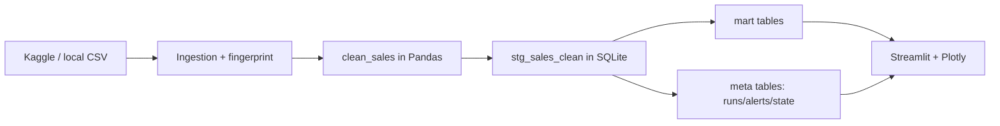

# מדריך אישי להצגת פרויקט Retail ETL (מפורט)

> **סנכרון עם האפליקציה:** ב־Streamlit, בסרגל הצד, סמן **Show Hebrew presenter hints** — בכל טאב יופיע Expander בעברית עם אותו תסריט תמציתי. התרשים האינטראקטיבי של הזרימה (Sankey) נמצא בטאב **Overview** תחת "Pipeline at a glance". מקור הקוד של הרמזים: `PRESENTER_HINTS_HE` ב־`src/retail_etl/presentation.py`.

## מטרת ההצגה

להראות פרויקט Data Engineering מלא: ingestion, ETL, SQL marts, ניטור, ודשבורד עם slicers מתקדמים — עם **סיפור עקבי** מקצה לקצה.

## סדר טאבים מומלץ (8–12 דקות)

1. **Overview** (2–3 דק׳) — היקף + סטטוס תפעולי + **תרשים Sankey**
2. **KPIs & trends** (2–3 דק׳) — KPI, מגמה חודשית, ימי שבוע, מפת חום, התפלגות חשבוניות
3. **Products** → **Customers** → **Countries** (3 דק׳ ביחד)
4. **RFM & analytics class** (2 דק׳)
5. **Architecture** (1–2 דק׳)
6. **Project summary** (1 דק׳)
7. **Staging table** (אופציונלי, עד דקה)

---

## 1) טאב Overview — מה מוצג ומה להגיד

### מה רואים על המסך (למעלה למטה)

| מרכיב | מה להגיד (עברית) |
|--------|-------------------|
| **ארבע מטריקות** (שורות staging, לקוחות, מדינות, טווח תאריכים) | "אלה המספרים הגולמיים אחרי ניקוי — כל שאר הדוחות נשענים על אותו grain." |
| **שורת Slicer result** | "מה שמוצג כאן מסונן לפי הצד: תאריכים, מדינות, מוצר, line total — זה מספר הכולל לכל הטאבים הבאים." |
| **Operational status** (רענון אחרון, מצב ריצה, alerts) | "גם בדיקה בלי שינוי קובץ נרשמת כהצלחה — לכן התאריך מתעדכן גם ב־noop." |
| **טביעת אצבע / SHA** | "אפשר להצביע על עקביות מול קובץ המקור בביקורת." |
| **כפתור Run refresh check** | "כאן מפעילים ניטור מול Kaggle/CSV: fingerprint, סכימה, וטעינה מבוקרת." |

### תרשים Sankey (Pipeline) — ב־Streamlit בלבד

- **מה זה:** תרשים זרימה אינטראקטיבי (Plotly) שמסכם את אותו סיפור כמו ב־Mermaid למטה.
- **קריאות:** שלבים **ממוספרים ①–⑦**, רקע צמתים **בהיר** וטקסט **כהה** (לא אפור על אפור); זרימות שקופות עדינות.
- **מה להגיד:** "משמאל מקור הנתונים, דרך ניקוי ו־staging, פיצול ל־mart tables ול־meta, ומשם לדשבורד. רוחבי הקווים אילוסטרטיביים — החשוב הוא הסדר והפיצול ל־observability."

### תרשים Mermaid (במסמך — לשקופית / README)

- **אם שואלים למה שני תרשימים:** "באפליקציה תרשים אחד חי לדמו; ב־Markdown תרשים מקובע לשקופית."

---

## 2) טאב KPIs & trends — לפי סדר הופעה

### Headline metrics (שורות מטריקות)

- **Total revenue / Units / Invoices** — "שלושת המספרים העסקיים המיידיים מהנתונים המסוננים."
- **ממוצעים** (invoice, lines per invoice, revenue per customer) — "מספרים מוכנים לשיחה עם הנהלה — אפשר להשוות לפני/אחרי שינוי slicers."
- **UK revenue share / distinct SKUs** — "בדאטה הקלאסי UK דומיננטי; זה מספר שכדאי להזכיר בהקשר גיאוגרפי."

### Monthly revenue (אזור + קו מגמה 3 חודשים)

- **מה להגיד:** "רואים עונתיות ושבירות אם עדכנו נתונים; הקו הכהה הוא ממוצע נע — לא תחזית, אלא החלקה לשיחה."

### Revenue by weekday

- **מה להגיד:** "מזהים ימים חזקים לקמפיינים ולוגיסטיקה; אם מצב Technical — אפשר להזכיר שזה נגזר מ־`InvoiceDate`."

### Shopping rhythm (מפת חום weekday × שעה)

- **Absolute revenue:** "כמה כסף בכל שעה — טוב כשהסכומים משמעותיים."
- **Share of weekday (%):** "כל שורה יום בשבוע מתנרמלת ל־100% — משווים *צורת יום* בין ימים גם כשההכנסה הכוללת שונה."
- **Business hours only:** "מזמינים את הקהל לחלון שעות רלוונטי (למשל 8–18) בלי לשנות את ה־ETL."

### Invoice size distribution

- **מה להגיד:** "היסטוגרמה + box — רואים אם יש 'זנב' של חשבוניות גדולות; חשוב לסיכון והנחות."

---

## 3) טאבים מוצרים / לקוחות / מדינות

### Products

- **גרף:** בר אופקי Top N.
- **מה להגיד:** "מזהים ריכוזיות Pareto — אם מעט מוצרים שולטים בהכנסות, יש תלות במלאי. שנה **Top N** כדי להראות גמישות."

### Customers

- **מה להגיד:** "אותו הקשר slicers מסונכרן עם שאר הטאבים — ההשוואה מוסרית. מקשרים ל־RFM לפעולות שימור."

### Countries

- **Treemap:** "גודל ∝ הכנסה; צבע מחזק הבדלים."
- **מה להגיד:** "בדאטה הזה לרוב UK גדול — שואלים האם יש פוטנציאל בחו״ל."

---

## 4) טאב RFM

- **סליידרים:** "ממקדים קהל: לא ישנים מדי, לא חד־פעמיים מדי, לא זניחים כספית."
- **גרף סגמנטים:** "איזה קודי RFM הכי מייצגים את הבייס."
- **בועות:** "X = recency, Y = frequency, גודל = monetary."
- **מה להגיד על קוד:** "הלוגיקה ב־`RetailAnalytics` / פונקציות עזר — ה־UI נשאר דק."

---

## 5) טאב Architecture

- **מה להגיד:** "מפרידים UI מלוגיקה; SQL בקבצים; allowlist לטבלאות; expander לדוגמה לקוד SQL אמיתי."

---

## 6) טאב Project summary

- **Executive:** value proposition בקצרה.
- **Technical:** רשימת שכבות (ETL, monitor, SQL, tests, Docker).

---

## 7) טאב Staging table

- גרעין הנתונים, `line_total`, כללי ניקוי — להפנות לטבלה במדריך למטה.

---

## מבנה הטבלה `stg_sales_clean`

| עמודה | טיפוס | מה זה אומר בפועל |
|--------|--------|-------------------|
| `InvoiceNo` | TEXT | מזהה חשבונית |
| `StockCode` | TEXT | SKU |
| `Description` | TEXT | תיאור מוצר |
| `Quantity` | INTEGER | כמות יחידות |
| `InvoiceDate` | TEXT | תאריך/שעה אחיד ל־SQLite |
| `UnitPrice` | REAL | מחיר ליחידה |
| `CustomerID` | INTEGER | מזהה לקוח |
| `Country` | TEXT | מדינה |
| `line_total` | REAL | `Quantity × UnitPrice` |

### חוקי ניקוי (שורה קצרה להצגה)

- תאריכים לא תקינים מוסרים.
- `Quantity <= 0` או `UnitPrice <= 0` מסוננים.
- שורות ללא `CustomerID` מוסרות (לפי קונפיגורציה).
- כפילויות מטופלות לטעינה מצטברת יציבה.

---

## טאץ' אנושי להצגה

- Dataset/filename לא יציבים ו־403/404 מול Kaggle — פתרון עם ברירות מחדל וטיפול ברור.
- UNIQUE בטעינה מצטברת — dedupe לפני אינדקס ייחודי.
- Slicers גלובליים + RFM — הפרי בכלים שימושיים.

---

## דגשים לשאלות בודקים

- **למה SQLite?** — פריסה קלה, הדגמת marts, מספיק לקורס/PoC.
- **איך מתמודדים עם schema drift?** — ניטור + alerts ב־meta.
- **למה SQL בקבצים?** — תחזוקה ו־review נוחים.

---

## תסריט פתיחה (20–30 שניות)

"זה פרויקט Data Engineering מלא על נתוני Retail: מקור מ־Kaggle או CSV, ניקוי ב־Pandas, טעינה ל־SQLite עם staging ומארטים, ניטור וטביעת אצבע, ודשבורד אינטראקטיבי עם slicers ו־RFM. ב־Overview יש גם תרשים זרימה חי לסיפור E→T→L."

## תסריט סיום (15–20 שניות)

"קיבלנו תשתית אנליטית עם SQL מופרד, ETL אמין, dashboard דינמי, וניטור שינויים — מתאים להצגה עסקית ולשקיפות הנדסית."
