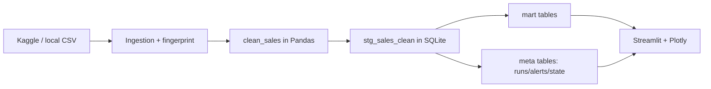

# מדריך אישי להצגת פרויקט Retail ETL (מפורט)

> **קריאה דו־לשונית (עברית + אנגלית):** רוב המסמך בעברית, יישור לימין (RTL). מונחים טכניים באנגלית (`ETL`, `Streamlit`, `SQLite` וכו׳) נשארים בכיוון **שמאל־ימין (LTR)** בתוך המשפט. בלוק **Mermaid** למטה מוצג ב־LTR כדי שהחיצים והתוויות יהיו קריאים.

> **סנכרון עם האפליקציה:** ב־Streamlit, בסרגל הצד, סמן **Show presenter hints** — בכל טאב יופיע Expander **באנגלית** (אותו סדר נושאים כמו במדריך הזה). המדריך בעברית כאן הוא הרחבה מפורטת להצגה חיה. התרשים האינטראקטיבי (Sankey) בטאב **Overview** תחת "Pipeline at a glance". מקור הקוד: `PRESENTER_HINTS` ב־`src/retail_etl/presentation.py`.

---

## מילון מושגים — הסברים (לא טריוויאלי)

להלן מונחים שמומלץ להכיר לעומק לפני ההצגה או כששואלים שאלות מעמיקות.

### Data Engineering וזרימת נתונים

| מושג | מה זה אומר בפרויקט הזה |
|------|------------------------|
| **ETL** | Extract–Transform–Load: חילוץ מה־CSV (או Kaggle), **טרנספורמציה** ב־Pandas (ניקוי, טיפוסים, `line_total`), **טעינה** ל־SQLite. לא רק “העתקת קובץ” — יש כללים עסקיים וטכניים. |
| **Grain / גרעין נתונים** | רמת הפירוט של כל שורה. כאן: **שורת חשבונית** (מוצר × כמות × מחיר לשורה). כל אגרגציה (חודש, לקוח, מדינה) נגזרת מאותו גרעין — חשוב להגיד בביקורת כדי שלא יערבבו בין ספירת שורות לספירת חשבוניות. |
| **Staging (`stg_sales_clean`)** | טבלה “נקייה” אחרי ניקוי, לפני או במקביל ל־**marts**. זה שכבת האמת לדשבורד ולרוב הגרפים. |
| **Mart (`mart_*`)** | טבלאות **אגרגציה עסקית** מוכנות לדוחות: הכנסות לפי חודש / מוצר / לקוח / מדינה. הן נבנות מחדש מה־staging אחרי ETL — לא נכנסות ידנית. |
| **Meta (`meta_*`)** | טבלאות **תפעול**: טביעת אצבע של קובץ ה־CSV, צילום סכימה, ריצות pipeline, **התראות**. זה לא “מכירות” — זה “איך ומתי טענו”. |
| **Fingerprint / טביעת אצבע** | בדרך כלל **SHA-256** על קובץ ה־CSV + גודל בבתים. משמש להשוואה בין מה שיש בדיסק לבין מה שנשמר ב־`meta` — כדי לדעת אם המקור השתנה בלי לפתוח את כל הקובץ. |
| **Schema drift** | כשעמודות ה־CSV **לא תואמות** למה שהמערכת מצפה לו (`EXPECTED_RAW_COLUMNS`). במקרה כזה נרשמת התראה מסוג `schema_change` — **לא** מריצים ETL עיוור. |
| **Incremental vs full load** | **Full**: זורקים את ה־staging (לפי הלוגיקה בקוד) וטוענים הכל מחדש. **Incremental**: מוסיפים שורות חדשות לפי תאריך מקסימלי ועם אינדקס ייחודי למניעת כפילויות. |
| **noop (no operation)** | ריצת ניטור שמסתיימת ב“אין שינוי בקובץ” — עדיין נרשמת כ**הצלחה** כדי שהזמן “בדיקה אחרונה” בדשבורד יתעדכן. |

### הדשבורד וה־UI

| מושג | מה זה אומר |
|------|------------|
| **Slicer / מסנן** | פקדים בסרגל (תאריכים, מדינות, סף שורה, חיפוש מוצר) שמצמצמים את **אותו DataFrame** לכל הטאבים — בלי להריץ מחדש ETL. |
| **Filtered scope** | השורה הקצרה **מעל הטאבים**: כמה שורות/חשבוניות/לקוחות/מדינות נשארו **אחרי** הסינון. |
| **Dataset scope** | ארבע המטריקות ב־Overview על **כל ה־staging** במסד — לפני הסינון בצד. ההבדל מול Filtered scope הוא נקודת ביקורת טיפוסית. |
| **KPI** | Key Performance Indicator — מדד עסקי מרוכז (הכנסה, יחידות, ממוצעים). כאן הם מחושבים על **הנתונים המסוננים**. |
| **Streamlit** | מסגרת Web ל־Python: ממשק, טאבים, סרגל, גרפים. הלוגיקה העסקית נשארת ב־`retail_etl`, לא בתוך ה־UI. |
| **Plotly** | ספריית גרפים אינטראקטיבית (זום, hover). בפרויקט: `plotly.express` ו־`plotly.graph_objects`. |

### אנליטיקה

| מושג | מה זה אומר |
|------|------------|
| **RFM** | **R**ecency — כמה זמן עבר מאז רכישה אחרונה; **F**requency — כמה חשבוניות (או כמה פעמים קנה); **M**onetary — כמה הכנסה צבר. משמש לסגמנטציה של לקוחות. |
| **qcut / quintile** | חלוקה ל־קווינטילים (חמישיות) כדי לתת ציון 1–5 לכל מימד ב־RFM — כשהתפלגות לא אחידה, הקוד מתמודד עם כפילויות (`duplicates="drop"`). |
| **Pareto / ריכוזיות** | התנהגות שבה מיעוט מוצרים או לקוחות מייצרים רוב ההכנסה — רלוונטי לטאבים Products/Customers. |
| **Heatmap weekday × hour** | מטריצה: יום בשבוע מול שעה. מצב **אבסולוטי** = סכומי כסף; מצב **% מהיום** = צורת יום נורמלית (סכום כל שורת יום = 100%). |

### אבטחה וקוד

| מושג | מה זה אומר |
|------|------------|
| **Allowlist (db_security)** | שמות טבלאות מותרים בלבד בקריאות דינמיות — מפחית סיכון ל־SQL injection כשמשתמשים בשמות טבלאות ממחרוזות. |
| **SQL בקבצים (`*.sql` bundles)** | שאילתות בחבילות עם סעיפים — נטענות ב־`load_sql_section`. נוח ל־review ולשינוי בלי לחפש מחרוזות בתוך Python. |

### זמן ותאריכים

| מושג | מה זה אומר |
|------|------------|
| **UTC ב־meta** | זמני ריצות ועדכונים נשמרים לעיתים כ־ISO ב־UTC. בדשבורד מוצגים בזמן **ישראל** (Asia/Jerusalem) בפורמט קומפקטי. |
| **InvoiceDate ב־SQLite** | נשמר כטקסט בפורמט אחיד אחרי ETL — מתאים ל־`strftime` בשאילתות SQL. |

---

## מטרת ההצגה

להראות פרויקט Data Engineering מלא: ingestion, ETL, SQL marts, ניטור, ודשבורד עם slicers מתקדמים — עם **סיפור עקבי** מקצה לקצה.

## סדר טאבים מומלץ (8–12 דקות)

1. **Overview** (2–3 דק׳) — היקף + סטטוס תפעולי + **תרשים Sankey**
2. **KPIs & trends** (2–3 דק׳) — KPI, מגמה חודשית, ימי שבוע, מפת חום, התפלגות חשבוניות
3. **Products** → **Customers** → **Countries** (3 דק׳ ביחד)
4. **RFM & analytics** (2 דק׳)
5. **Architecture** (1–2 דק׳)
6. **Project summary** (1 דק׳)
7. **Staging table** (אופציונלי, עד דקה)

---

## 1) טאב Overview — מה מוצג, מה להגיד, והרחבות

### מה רואים על המסך (למעלה למטה)

| מרכיב | מה להגיד (עברית) | הרחבה |
|--------|-------------------|--------|
| **שורת Filtered scope** | כמה שורות/חשבוניות/לקוחות/מדינות נשארו אחרי הסינון — משותף לכל הטאבים. | זה **לא** מריץ שאילתה חדשה לכל טאב; אותו slice נשמר בזיכרון ומזין את כל הגרפים. |
| **ארבע מטריקות Dataset scope** | סטטיסטיקה על **כל** ה־staging במסד, לפני מסננים. | מדגים “כמה יש לנו בבנק” לעומת “מה בחרתי לבחון עכשיו”. |
| **Operational status** | רענון אחרון, מצב ריצה, מספר התראות. | גם **noop** (בלי שינוי קובץ) נספר כהצלחה — כדי שהצגת “נבדק לאחרונה” תהיה אמינה. |
| **טביעת אצבע / SHA** | עקביות מול קובץ הגולמי. | מתאים לשאלה “איך יודעים שזה אותו קובץ שקיבלנו מהספק/מ־Kaggle”. |
| **Run refresh check** | מפעיל את מסלול הניטור: הורדה אופציונלית, השוואת SHA, בדיקת סכימה, והחלטה על full/incremental. | אם אין credentials ל־Kaggle, עדיין אפשר לעבוד על CSV מקומי. |

### תרשים Sankey (Pipeline) — ב־Streamlit בלבד

- **מה זה Sankey:** תרשים זרימה שבו **רוחב הקישורים** מסמן יחסי גודל (כאן — אילוסטרטיבי). חשוב לומר שהדגש הוא על **סדר השלבים** ולא על מספרים מדויקים.
- **למה Marts ו־Meta מתפצלים אחרי staging:**  
  - **Marts** = תשובות עסקיות (כמה מכרנו, לאן).  
  - **Meta** = איך טענו ומתי (ביקורת, תפעול).
- **מה להגיד:** "משמאל מקור הנתונים, דרך ניקוי ו־staging, פיצול ל־**עובדות עסקיות מצטברות (marts)** מול **מטא־דאטה של הצינור (meta)** — ומשם לדשבורד."

### תרשים Mermaid (במסמך — לשקופית / README)

- **אם שואלים למה שני תרשימים:** "באפליקציה תרשים אחד חי לדמו; ב־Markdown תרשים מקובע לשקופית."

---

## 2) טאב KPIs & trends — לפי סדר הופעה

### Headline metrics

- **Total revenue / Units / Invoices** — שלושת המספרים העסקיים המיידיים מהנתונים המסוננים.
- **ממוצעים** — מחושבים על **חשבוניות** או **לקוחות** לפי ההגדרה בקוד; כדאי להבהיר שלא מדובר בממוצע “גלובלי” חסר הקשר.
- **UK revenue share** — בדאטה הקלאסי של Online Retail בריטניה דומיננטית; המספר תומך בשאלות על פיזור גיאוגרפי.

### Monthly revenue (אזור + קו 3 חודשים)

- הקו המנוקה הוא **ממוצע נע** — לא תחזית סטטיסטית, אלא כלי לשיחה על מגמה.

### Revenue by weekday

- נגזר מ־`InvoiceDate` — אם כל השעות ב־00:00 (תלוי במקור), עדיין יש משמעות ליום בשבוע.

### Shopping rhythm (מפת חום)

- **Absolute revenue:** מתאים כשרוצים להשוות סכומים בין חלונות זמן.
- **Share of weekday (%):** מנרמל כל יום ל־100% — משווה *צורת* יום בלי להטות בגלל הכנסה כוללת גבוהה ביום אחד.
- **Business hours:** חיתוך עמודות שעה בלי לשנות ETL.

### Invoice size distribution

- **היסטוגרמה + box** — ה־box מדגיש חציון ורבעונים; "זנב" של חשבוניות גדולות רלוונטי למדיניות הנחות ואשראי.

---

## 3) טאבים מוצרים / לקוחות / מדינות

### Products

- **Top N** — משנים את N כדי להראות שקל לזוז בין “פוקוס על אליטה” ל“רוחב פורטפוליו”.
- **Pareto:** אם 20% מהמוצרים נותנים 80% מההכנסה — לומר את זה במילים פשוטות.

### Customers

- אותם slicers כמו בשאר הטאבים — ההשוואה בין Products ל־Customers “נקייה”.
- קישור ל־RFM: כאן רואים **מי** מכניס; ב־RFM רואים **איך** לסווג לפעולות שימור.

### Countries

- **Treemap:** שטח ∝ הכנסה; צבע מחזק הבדלים.
- UK דומיננטי בדאטה הזה — פותח שיחה על פוטנציאל בינלאומי.

---

## 4) טאב RFM

- **סליידרים:** מסננים לקוחות “רלוונטיים” — לא רחוקים מדי בזמן, לא חד־פעמיים, לא זניחים בכסף.
- **גרף סגמנטים:** קודי RFM הם שילוב ציונים — לא “קסם”, אלא כלי סיווג.
- **בועות:** גודל = monetary; ציר X = recency (ימים) — לקוחות בפינה הימנית־תחתונה לרוב “כסף גבוה אבל לא נראו זמן” (תלוי בקווינטילים).

---

## 5) טאב Architecture

- הפרדה בין **UI** (`app.py`) לבין **חבילה** (`retail_etl`).
- **SQL בקבצים** + **allowlist** — שקיפות ובטיחות.
- Expander עם SQL אמיתי — מראה שאפשר לשנות שאילתה בלי לצוד מחרוזות בפייתון.

---

## 6) טאב Project summary

- **Executive:** ערך עסקי בקצרה.
- **Technical:** שכבות: ETL, monitor, SQL bundles, pytest, Docker.

---

## 7) טאב Staging table

- טבלת תצוגה מקדימה של **אותו slice** כמו הגרפים.
- `line_total` הוא **פיצ’ר מחושב** ב־ETL, לא עמודה גולמית מה־CSV.

---

## מבנה הטבלה `stg_sales_clean`

| עמודה | טיפוס | מה זה אומר בפועל |
|--------|--------|-------------------|
| `InvoiceNo` | TEXT | מזהה חשבונית |
| `StockCode` | TEXT | SKU |
| `Description` | TEXT | תיאור מוצר |
| `Quantity` | INTEGER | כמות יחידות |
| `InvoiceDate` | TEXT | תאריך/שעה אחידים ל־SQLite (אחרי המרה מפנדס) |
| `UnitPrice` | REAL | מחיר ליחידה |
| `CustomerID` | INTEGER | מזהה לקוח |
| `Country` | TEXT | מדינה |
| `line_total` | REAL | `Quantity × UnitPrice` |

### חוקי ניקוי (שורה קצרה להצגה)

- תאריכים לא תקינים מוסרים.
- `Quantity <= 0` או `UnitPrice <= 0` מסוננים.
- שורות ללא `CustomerID` מוסרות (לפי קונפיגורציה).
- כפילויות לפי מפתח טבעי מטופלות לטעינה יציבה (במיוחד עם אינדקס ייחודי ב־incremental).

---

## טאץ' אנושי להצגה

- Dataset/filename לא יציבים ו־403/404 מול Kaggle — פתרון עם ברירות מחדל וטיפול ברור.
- UNIQUE בטעינה מצטברת — dedupe לפני אינדקס ייחודי.
- Slicers גלובליים + RFM — הפרי בכלים שימושיים.

---

## דגשים לשאלות בודקים

- **למה SQLite?** — פריסה קלה, הדגמת marts, מספיק לקורס/PoC; לא תמיד הפתרון לייצור בקנה מידה ענק.
- **איך מתמודדים עם schema drift?** — ניטור + התראות ב־meta; לא טוענים “עיוור” אם העמודות השתנו.
- **למה SQL בקבצים?** — תחזוקה, review, והפרדה מהלוגיקה בפייתון.

---

## תסריט פתיחה (20–30 שניות)

"זה פרויקט Data Engineering מלא על נתוני Retail: מקור מ־Kaggle או CSV, ניקוי ב־Pandas, טעינה ל־SQLite עם staging ומארטים, ניטור וטביעת אצבע, ודשבורד אינטראקטיבי עם slicers ו־RFM. ב־Overview יש גם תרשים זרימה חי לסיפור E→T→L."

## תסריט סיום (15–20 שניות)

"קיבלנו תשתית אנליטית עם SQL מופרד, ETL אמין, dashboard דינמי, וניטור שינויים — מתאים להצגה עסקית ולשקיפות הנדסית."

