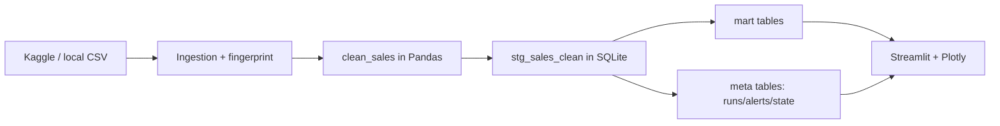

# מדריך אישי להצגת פרויקט Retail ETL

## מטרת ההצגה
להראות פרויקט Data Engineering מלא: ingestion, ETL, SQL marts, ניטור, ודשבורד עם slicers מתקדמים.

## סדר טאבים מומלץ (8-12 דקות)

1. `Overview` (2-3 דק')
2. `KPIs & trends` (2 דק')
3. `Products` + `Customers` + `Countries` (2-3 דק')
4. `RFM & analytics class` (2 דק')
5. `Architecture` (1-2 דק')
6. `Project summary` (1 דק')
7. `Staging table` (אופציונלי, 30-60 שניות)

## מה להגיד בכל טאב

### 1) Overview
- "הפרויקט רץ מקצה לקצה: Kaggle/CSV -> ניקוי ב-Pandas -> טעינה ל-SQLite -> הצגה ב-Streamlit."
- "בחלק הזה רואים סטטוס תפעולי אמיתי: זמן רענון אחרון, alerts, וטביעת אצבע של מקור הנתונים."
- "יש לנו גם כפתור refresh עם ניטור שינויי מקור וסכימה."

### 2) KPIs & trends
- "כאן אני מציג KPI עסקיים מרכזיים: revenue, invoices, customers, SKU diversity."
- "יש **מפת חום weekday × שעה** — אפשר מצב הכנסה מוחלטת או **אחוז מתוך אותו יום בשבוע**, ואופציה לחלון **שעות עסקים** (זום לשעות רלוונטיות)."
- "כל המספרים והגרפים כאן מגיבים ל-slicers הגלובליים בצד (תאריך/מדינה/מוצר/line_total)."
- "כך אפשר לבצע ניתוח אד-הוק בזמן אמת בלי להריץ ETL מחדש."

### 3) Products / Customers / Countries
- "אני מדגים פילוח לפי ישויות עסקיות עיקריות: מוצר, לקוח, מדינה."
- "הטאבים האלו נועדו לזהות ריכוזיות הכנסות, תלות בלקוחות גדולים, ופוטנציאל גיאוגרפי."
- "Top N מאפשר drill-down מהיר לשיחה ניהולית."

### 4) RFM & analytics class
- "ה-RFM מחושב לפי הנתונים המסוננים, עם slicers ייעודיים ל-recency/frequency/monetary ולבחירת סגמנטים."
- "זה נותן מיידית רשימת קהלי יעד לשימור והחזרה לפעילות."
- "הלוגיקה האנליטית מרוכזת במחלקת `RetailAnalytics` כדי לשמור על UI דק ותחזוקה נכונה."

### 5) Architecture
- "הארכיטקטורה מפרידה אחריות: ingestion/monitor/etl/analytics/export/plotting."
- "SQL חי בקבצי `src/retail_etl/sql/*.sql`, וה-Python טוען אותם דרך `utils.load_sql`."
- "הפרדה זו מקלה על סקירה, בדיקות, ושינויים עתידיים."

### 6) Project summary
- "כאן אני מסכם את value proposition: אמינות נתונים, ניטור, ויכולת קבלת החלטות מהירה."
- "הפרויקט מוכן לייצור בקנה מידה קטן-בינוני עם Docker והרצת CI/tests."

### 7) Staging table (אופציונלי)
- "מציג את גרעין הנתונים `stg_sales_clean` כדי להוכיח data contracts ו-cleaning rules."

## מבנה הטבלה המרכזית: `stg_sales_clean`

זו הטבלה החשובה ביותר במערכת. כל ה־marts והגרפים נבנים ממנה.

| עמודה | טיפוס | מה זה אומר בפועל |
|---|---|---|
| `InvoiceNo` | `TEXT` | מזהה חשבונית (transaction). |
| `StockCode` | `TEXT` | קוד מוצר (SKU). |
| `Description` | `TEXT` | תיאור מוצר לאחר ניקוי רווחים וערכים חסרים. |
| `Quantity` | `INTEGER` | כמות יחידות בשורת החשבונית. |
| `InvoiceDate` | `TEXT` | תאריך/שעה בפורמט אחיד (`YYYY-MM-DD HH:MM:SS`) לשאילתות SQLite. |
| `UnitPrice` | `REAL` | מחיר ליחידה. |
| `CustomerID` | `INTEGER` | מזהה לקוח (לאחר סינון/המרה). |
| `Country` | `TEXT` | מדינה לאחר ניקוי טקסט. |
| `line_total` | `REAL` | שדה מחושב: `Quantity * UnitPrice`. |

### מה להגיד בקצרה כשמציגים את הטבלה

- "זו שכבת ה־staging הנקייה, ברמת grain של שורת חשבונית."
- "העמודה `line_total` היא פיצ'ר הנדסי שנוצר ב־ETL ומפשט את האנליטיקה."
- "מכאן נגזרים כל המדדים בטאבים: KPIs, מוצרים, לקוחות, מדינות ו־RFM."

### חוקי ניקוי עיקריים שכדאי להזכיר

- תאריכים לא תקינים מוסרים.
- `Quantity <= 0` או `UnitPrice <= 0` מסוננים.
- שורות ללא `CustomerID` מוסרות (לפי קונפיגורציה).
- כפילויות מפתח מטופלות כדי לתמוך בטעינה מצטברת יציבה.

## תרשים זרימה להצגה (Mermaid)

מה להגיד על התרשים:
- "זה לא pipeline ליניארי בלבד - יש גם שכבת observability (`meta_*`) שמחזירה מידע לדשבורד."
- "כל מה שמוצג למשתמש הסופי מגיע או מ־marts או ממטא־טבלאות, לא מקריאות ad-hoc לא מבוקרות."

## טאץ' אנושי להצגה (מה למדתי בדרך)

- "בהתחלה ניסיתי dataset/filename לא יציבים ונתקלתי ב-403/404 מול Kaggle API."
- "אחרי זה קיבעתי ברירת מחדל יציבה ובניתי טיפול שגיאות ברור למשתמש."
- "היו לי גם בעיות UNIQUE בטעינה מצטברת — פתרתי עם dedupe לפני אינדקס ייחודי."
- "השיפור הכי משמעותי מבחינת שימושיות היה slicers גלובליים + RFM slicers."
- "מבחינתי זה ההבדל בין פרויקט 'שעובד' לבין מוצר שאפשר להציג בביטחון."

## דגשים לשאלות בודקים

- **למה SQLite?**: קלות פריסה, הדגמת מודל marts, מספיק לסביבת קורס/PoC.
- **איך מתמודדים עם schema drift?**: ניטור סכימה + alerts ב-meta tables.
- **למה SQL בקבצים נפרדים?**: maintainability, code review נוח, הפרדת concerns.
- **איך הפרויקט ניתן לתחזוקה?**: שכבות ברורות, tests, לוגים, CLI, Docker, קונפיגורציה דרך env.

## תסריט פתיחה קצר (20-30 שניות)

"זה פרויקט Data Engineering מלא על נתוני Retail. המערכת מורידה נתונים מ-Kaggle, מנקה ומעשירה אותם ב-Pandas, טוענת ל-SQLite כ-staging+marts, ומציגה dashboard אינטראקטיבי עם slicers עסקיים מתקדמים. בנוסף יש ניטור מקור, alerts, ו-CLI מלא להפעלה ותחזוקה."

## תסריט סיום קצר (15-20 שניות)

"בסוף קיבלנו תשתית אנליטית קלה לתחזוקה: SQL מופרד, ETL אמין, dashboard דינמי, וניטור שינויים. זה מאפשר גם הצגה עסקית וגם שקיפות הנדסית מלאה."
